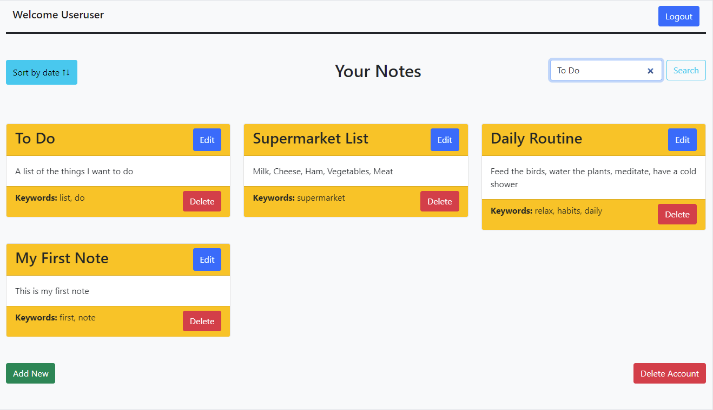
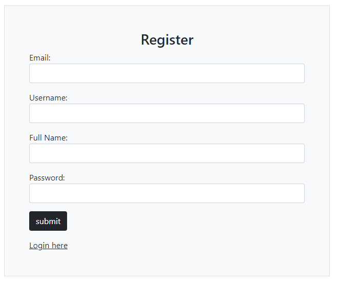
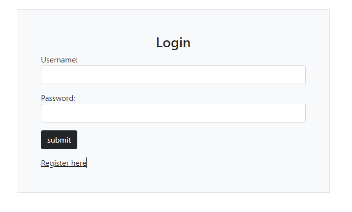
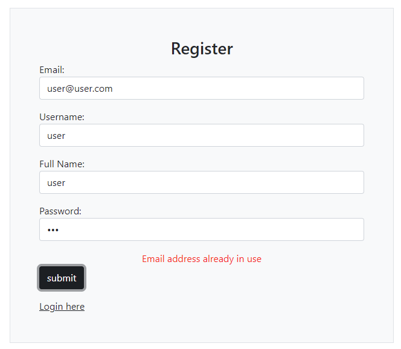
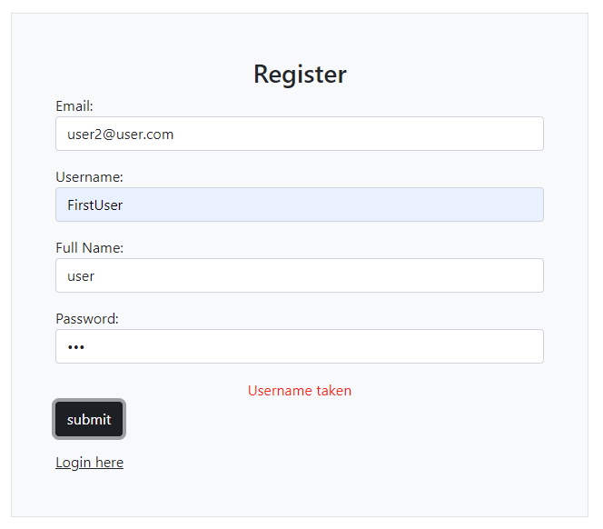
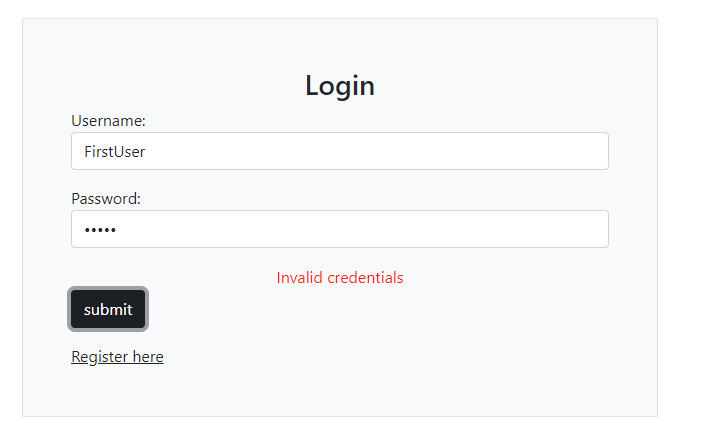
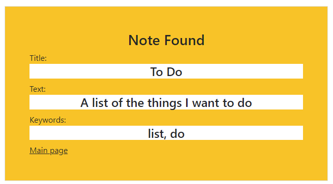
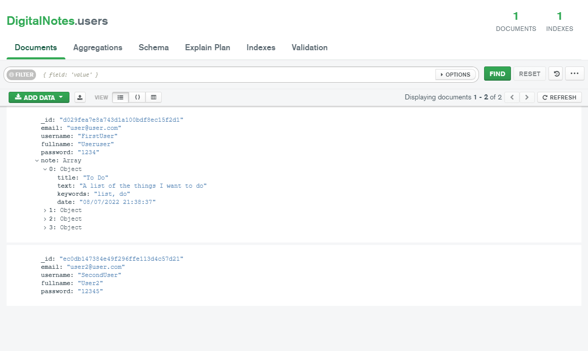

# YpoxreotikiErgasia22_E12132_Nomikos_Anastasios

Το σύστημα που αναπτύχθηκε αφορά την υλοποίηση μιας εφαρμογής καταγραφής σημειώσεων. Παρακάτω περιγράφονται αναλυτικά όλες οι λειτουργίες του συστήματος.

------------
## Σύστημα Register/Login ##

  

Την πρώτη φορά που ένας νέος χρήστης επισκέπτεται την εφαρμογή, πρέπει να δημιουργήσει έναν νέο λογαριασμό με την υπηρεσία Register, εισαγάγοντας τα απαραίτητα στοιχεία. Εφόσον έχει δημιουργηθεί λογαριασμός, ο χρήστης μπορεί να εισέλθει στην εφαρμογή πληκτρολογώντας το username και to password του. Έχουν υλοποιηθεί κατάλληλοι έλεγχοι ώστε:

* Κάθε χρήστης που δημιουργείται να έχει μοναδικό email:

* Κάθε χρήστης που δημιουργείται να έχει μοναδικό username:

* Κάθε χρήστης που θέλει να μπει στο σύστημα να πληκτρολογεί τα σωστά στοιχεία:

------------

Εφόσον γίνει είσοδος στο σύστημα ο χρήστης βρίσκεται στην αρχική σελίδα.

------------
Βασικές Λειτουργίες
============

1. Στην αρχική οθόνη ο χρήστης βλέπει όλες του τις σημειώσεις.

2. Ο χρήστης μπορεί να πραγματοποιήσει έξοδο από το σύστημα.

3. Ο χρήστης μπορεί να διαγράψει το account του.

4. Ο χρήστης μπορεί να εισαγάγει μία νέα σημείωση και να βάλει τίτλο, κείμενο και λέξεις κλειδιά. Πατώντας δημιουργία αποθηκεύεται αυτόματα και η ημερομηνία δημιουργίας της σημείωσης.

5. Ο χρήστης μπορεί να τροποποιήσει κάποια από τις σημειώσεις του. Πατώντας το κουμπί εμφανίζονται όλες οι πληροφορίες της σημείωσης, τις οποίες μπορεί να τροποποιήσει και να την αποθηκεύσει.

6. Ο χρήστης μπορεί να διαγράψει μια σημείωση. Η σημείωση αφαιρείται κατευθείαν από την αρχική σελίδα, χωρίς να χρειάζεται refresh.

7. O χρήστης μπορεί να κάνει αναζήτηση μιας σημείωσης με τον τίτλο της. Εφόσον η σημείωση βρεθεί, εμφανίζεται σε ξεχωριστή σελίδα με τις πληροφορίες της.

------------
Βάση Δεδομένων
============

Παρακάτω βλέπουμε ένα στιγμυότυπο της βάσης δεδομένων.

